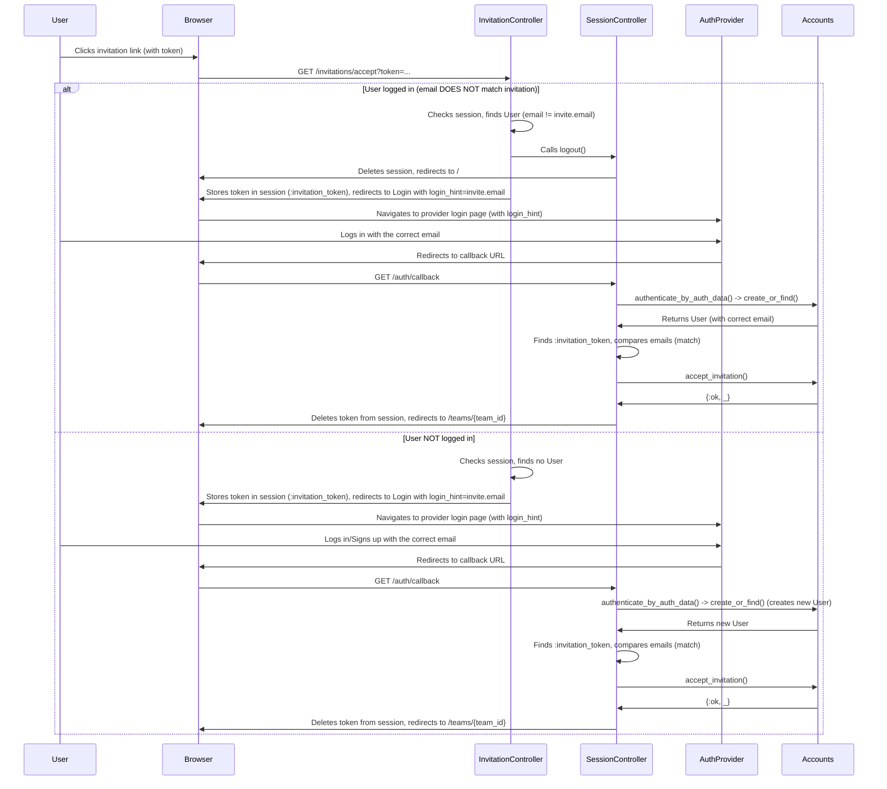

# Invitation Flow Analysis and Proposals

## Current Invitation Handling Flow



## Potential Issues

1.  **Scenario 1 (Logged in, wrong email):**
    - **Abrupt Logout:** The user is suddenly logged out, potentially losing context or unsaved work elsewhere.
    - **User Dependency:** The flow relies heavily on the user noticing the `login_hint` and flash message and selecting the correct account at the provider. Re-logging in with the wrong email leads to an error and potential confusion.
2.  **Scenario 2 (Not logged in, new user):**
    - The current flow is generally logical. The main potential issue is UX: the user might not fully understand that the login/signup process is tied to accepting a team invitation.

## Proposed Solutions

### 1. Improvements for Scenario 1 (Logged in, wrong email)

- **Option A: Intermediate Page/Modal (Recommended)**

  - **Logic:** Instead of immediate logout, show an intermediate page or modal when an email mismatch is detected.
  - **Content:**
    - Message: "This invitation is for `invite_email`, but you are logged in as `current_email`."
    - Actions:
      1.  "Logout and login as `invite_email`" -> Triggers the current flow (logout, store token, redirect to login with hint).
      2.  "Switch account at provider" (if applicable, e.g., for Google) -> May also initiate logout/login, potentially smoother for the user.
      3.  "Cancel" -> Return to the previous page or dashboard.
  - **Benefits:** Provides user control and understanding _before_ logout. Reduces error likelihood and confusion.

  ```mermaid
  sequenceDiagram
      participant User
      participant Browser
      participant InvitationController
      participant IntermediatePage
      participant SessionController
      participant AuthProvider

      User->>Browser: Clicks invitation link
      Browser->>InvitationController: GET /invitations/accept?token=...
      InvitationController->>InvitationController: Checks session, finds User (email != invite.email)
      InvitationController->>Browser: Redirects to intermediate page (with token and email info)
      Browser->>IntermediatePage: Displays info and options
      User->>IntermediatePage: Selects "Logout and login as invite.email"
      IntermediatePage->>SessionController: Requests logout
      SessionController->>Browser: Deletes session, redirects to /
      IntermediatePage->>Browser: Stores token in session, redirects to Login with login_hint=invite.email
      Browser->>AuthProvider: Navigates to login page... (continues as current flow)
  ```

- **Option B: Account Linking (Alternative, More Complex)**
  - **Logic:** Allow users to link multiple emails/provider accounts to a single Runa account. If `invite_email` is linked to `current_user`, accept the invitation directly.
  - **Complexity:** Requires significant changes to the user data model and authentication logic.

### 2. Improvements for Scenario 2 (Not logged in, new user)

- **Current Flow:** Generally adequate.
- **UX Enhancement:**
  - On the login/signup page reached via an invitation link, add explicit text: "You are accepting an invitation to the `Team Name` team." or "Log in or sign up to accept the invitation."
  - This context (e.g., team ID/name) can be passed via URL parameters during the redirect or stored in the session alongside the invitation token.
